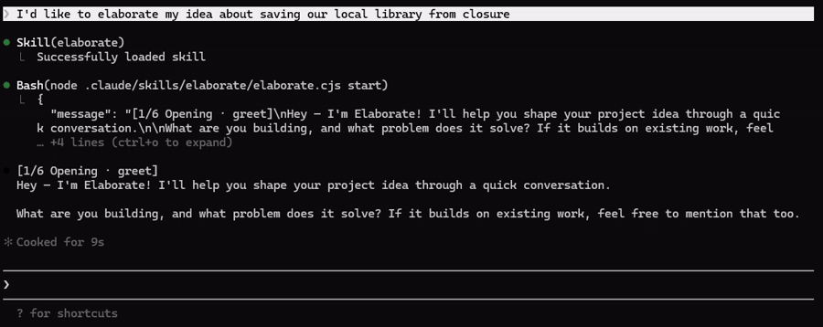

# Elaborate

AI Socratic interviewer that turns vague ideas into structured intent.

[](https://github.com/alexbot/elaborate/actions/workflows/ci.yml)
[](LICENSE)



## The Problem

Most projects start with a gap between "I have an idea" and "I know what to build." People either jump straight to code or hand an AI a one-line prompt and hope for a spec. Both skip the hard part: figuring out what success looks like, who cares, where the boundaries are, and which assumptions will bite you later.

Traditional methods for this exist — but they depend on trained facilitators and structured workshops. Solo developers, founders, and small teams skip them entirely. The result: projects start with vague goals and discover critical gaps mid-build.

## What Elaborate Does

Elaborate runs a structured interview — 25-32 questions across seven phases — that moves you from a vague idea to a scoped project definition.

| Phase | What it covers |
|-------|---------------|
| **Opening** | Context and framing — greenfield or existing project? |
| **Purpose** | What problem are you solving? What does success look like? |
| **Goals** | Concrete, measurable outcomes with rationale |
| **Stakeholders** | Who cares, what they need, where interests conflict |
| **Scope** | What's in, what's out, why the boundary sits there |
| **Assumptions** | What you're taking for granted that could invalidate everything |
| **Validation** | Review and confirm — or revise before you build |

Every goal, stakeholder, scope decision, and assumption in the output traces back to the conversation turn that produced it.

## Quick Start

<!-- Install commands are placeholders — actual install path TBD (see public-repository-multi-platform, public-repository-npm-release) -->

```bash
# Install
# TBD — install mechanism under development

# Run — either way works
/elaborate
# or just say it naturally:
"I'd like to elaborate my latest idea about a neighborhood recycling app"
```

Elaborate is a Claude Code skill, so it responds to both the slash command and natural language that signals intent to elaborate an idea.

## Example: Saving a Library Branch

A volunteer wants to save their neighborhood library from closure. The input:

> *"The city's talking about closing it because foot traffic has dropped. I don't want to see that happen — the library's been part of this neighborhood for a long time. I want to figure out how to bring people back."*

After 28 questions, the respondent had reversed their own premise: "I've been working backwards — I never stopped to ask whether the library is actually what the neighborhood needs." What started as "bring people back" became a research phase that could confirm or kill the original idea — and the respondent was the one who got there, not the tool.

[Read the full brief →](docs/examples/library.brief.md)

See also: [Elaborate interviews itself](docs/examples/elaborate.brief.md) (the tool pointed at its own premise) and [selling cookies at the farmers market](docs/examples/cookies.brief.md) (a $500 hobby that might be a business). More examples across domains — from [federal spending oversight](docs/examples/federalspending.brief.md) to [elderly independent living](docs/examples/alfred.brief.md) — in [docs/examples/](docs/examples/).

### Output

The interview produces a session file (`.elaborate/session.yaml`) — a structured YAML artifact with every goal, stakeholder, scope item, and assumption traced to the conversation turn that produced it. This is machine-consumable: designed as input for spec-driven development tools, code generators, or any pipeline that needs structured intent.

If you want something presentable — for a business plan, a stakeholder pitch, or a project kickoff — run `/project-brief` on the session file to generate a readable markdown brief. The skill prompt is in [`docs/skills/project-brief.md`](docs/skills/project-brief.md).

All examples above are generated by the automated test suite using a simulated respondent (an LLM playing the person with the idea). The briefs are generated from those sessions using the project-brief skill. You can reproduce both by running the scenario harness yourself.

## How It Works

The interview techniques draw on qualitative research traditions:

- **Kvale & Patton** — semi-structured interview design
- **Miller & Rollnick** — motivational interviewing (surfacing ambivalence without pushing)
- **Reynolds & Gutman** — means-end laddering (climbing from features to underlying values)
- **KAOS** — goal decomposition (structuring what emerges into testable hierarchies)

The AI asks questions, flags ambiguity, and structures what you say. It never fills gaps on its own — you decide everything.

See [docs/decisions/](docs/decisions/) for the full architecture story.

## Development

```bash
npm install
npm run build          # TypeScript compilation
npm run build:skill    # esbuild bundle → dist/skill/
npx vitest run         # Run tests
```

## Contributing

See [CONTRIBUTING.md](CONTRIBUTING.md) for setup, architecture, and how to pick up work.

## License

[MIT](LICENSE)
